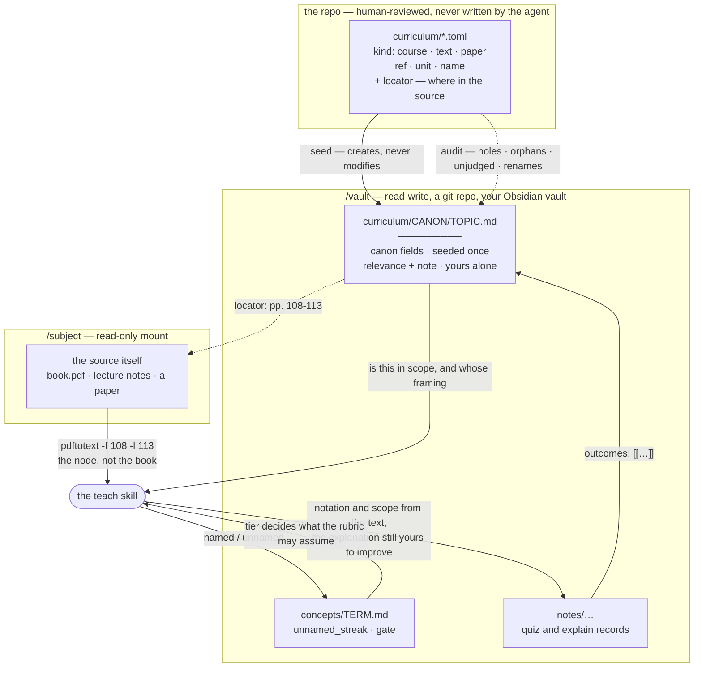

# The curriculum layer

Where the lesson DAG's **node set** comes from, and why it is not generated.

## The problem this solves

An omission is invisible. A wrong *edge* surfaces during teaching — the lesson
feels out of order, a node fails to motivate the next one, and the learner says
so. A **missing node** never surfaces, because nothing points at it.

That asymmetry is the whole argument:

| | From-scratch risk | Self-correcting? |
|---|---|---|
| **Node set** — what exists to be learned | High. Omissions are silent | **No.** Nothing points at the missing thing |
| **Edges** — what depends on what | Lower. Wrong order is locally visible | **Yes.** A bad edge makes a confusing lesson |

And the vault makes it worse, not better: it is a durable record by design, so a
hole in the first generation is inherited by every later session. Structurally
the same failure as a softened rubric, running the other way — a bad commitment
locked in early and never audited.

**So: import the node set, let the agent infer the edges.** The agent is good
at local structure given context. Coverage is not local.

## Three layers, and the separation is the point

**1. The canon.** Checked into this repo, cited to MIT OCW, **never edited by
the agent.** Its value *is* being un-edited: the moment an agent can revise it,
a missing topic can be quietly rationalized away instead of declined in the
open.

**2. Relevance.** Per vault, mutable, jointly authored. Whether a canonical
topic matters *for these objectives*.

**3. Evidence.** What was actually taught and how it went, linked back to the
canon.

Layer 3 needs no new machinery. `derive` already writes
`concept: "[[…]]"` — point those wikilinks at curriculum topics and "how did I
do on 18.06 unit 3" is a Dataview query over notes that already exist.

## Why relevance is structured *and* prose

The enum is what makes coverage countable. The prose is what makes it true,
because the common judgment is not *skip* — it is **"cover, but reframe"**.

The worked example, and the reason this layer exists at all: much of a standard
linear algebra course motivates through three-dimensional geometry, because that
is where physical intuition lives. Statistics and ML need the same results in
$n$ dimensions, where that intuition does not reach. Determinants as a scaling
factor on volume in $\mathbb{R}^3$ and determinants as a change-of-measure term
in a density transform are the same theorem and different lessons. No enum
holds that; a sentence does.

```yaml
---
type: curriculum-topic
curriculum: mit-18.06sc        # canon: never edited
canon_kind: course             # course | text | paper
canon_title: "18.06SC Linear Algebra"
canon_ref: "mit-18.06sc/U2-02"
locator: ""                    # where in the source, when it says
unit: "Unit II: Least Squares, Determinants and Eigenvalues"
topic: "Projections onto Subspaces"
source: canon                  # provenance: canon | agent
relevance: cover               # unset | cover | skip | deferred
relevance_decided_by: joint    # user | agent | joint
first_taught: 2026-10-02
outcomes: ["[[quiz-6c2495]]", "[[derive-007]]"]
---

Cover, but **reframe for n dimensions**. OCW motivates this through 3D
geometry; we need it as the projection step in least squares and as the
geometry behind conditional expectation.
```

**`relevance: unset` is the important state.** It is the queryable hole: a
canonical topic neither party has judged yet. That is the audit the design
demands — not "did the agent build a good DAG" but "is there anything nobody
has looked at".

Topic notes are seeded up front, one per canonical topic, so coverage can be
queried across topics that have never been touched. A topic with no note cannot
carry a relevance decision, and a hole that cannot be recorded is a hole that
cannot be reviewed.

## Prefer importing a standard over generating a topic

**Stated as a rule, deliberately not enforced in code.**

When teaching runs into something outside the current curriculum — a
multivariable calculus lesson leaning on kinematics, say — the preferred move is
to **import the relevant MIT standard** (8.01 here) rather than to invent a
node for it.

The reasoning is the same asymmetry as above, applied at the margins. Invented
marginal topics accumulate as cruft: plausible, unreviewed, and permanent once
written to the vault. An imported standard arrives with a citation, a unit
structure someone else thought about, and its own coverage audit.

**This is an intuition, not a measurement.** It may prove more burdensome than
it is worth — an import is heavier than a sentence, and most marginal
references probably do not deserve a whole course. Revisit when either
symptom appears: imports feeling like ceremony for one-off references, or the
vault filling with single-node curricula nobody returns to.

Non-canonical nodes remain legal and must carry `source: agent`, so the
superset is legible as a superset. The work is expected to be a subset of the
canon in places and a superset in others; both are fine, and only the second
needs marking.

## How it fits together

Grouped by **write scope**, because that is the organizing constraint rather
than a filesystem detail: the canon is reviewed and never written by the agent,
the source is a read-only mount, and only the vault is writable.



Four things the diagram is meant to make obvious:

- **The only cycle runs through the vault.** Teaching writes evidence, evidence
  attaches to the topic note, and the topic note shapes the next lesson. The
  canon and the source never learn anything, which is what makes them a fixed
  reference to measure against.
- **`locator` is a dotted edge, not a copy.** It is a pointer from the vault
  into the read-only source. Nothing extracts the book into the vault.
- **The two arrows into the agent carry different authority.** The topic note
  says what is in scope; the source says how it is written. Neither says how to
  explain it.
- **The concept ledger is the only edge that constrains the agent.** Everything
  else informs it. `gated` is a refusal, and it is enforced in the tool rather
  than requested in a prompt.

## Three kinds of source, one import path

A canon is not always a course. Added 2026-09-11, when the first real need
arrived: a live class with a set textbook.

| `kind` | Citation needs | Ordered for teaching? | Typical use |
|---|---|---|---|
| `course` | `number`, `url` | Yes | A syllabus |
| `text` | `author`, `edition` | Usually | A textbook's table of contents |
| `paper` | `author`, `url` | **No** | Something you have to present or be examined on |

What they share is the only property this layer actually depends on: an
externally authored node set with a citation and a date someone checked it.
They differ in what citing them *requires*, which is why the required fields
are per-kind rather than universal — asking a book for a course number means
inventing one, and inventing identifiers in the canon is the failure this file
exists to prevent.

The table's third column is not enforced and matters more than the first two.
A textbook's chapter order is a defensible starting DAG. **A paper's section
order is rhetorical**, written for a reader who already knows the field, so
using it as a lesson sequence yields a plan shaped like an argument rather than
like a dependency graph. A paper's sections are things to be quizzed on; the
teaching is in the background it silently assumes.

The table is `[source]`, with `[course]` accepted as a synonym so the four
existing canons keep working. Having both in one file is an error.

## Grounding, and why the locator earns its keep

The request that produced all this: *explain things using my class's textbook
rather than your own examples.* It splits in two, and only one half costs
context.

| | Question | Mechanism | Cost |
|---|---|---|---|
| **Coverage** | What is in the text, and where am I in it | This layer | Zero at runtime |
| **Grounding** | Whose notation and examples the explanation uses | `/subject` + retrieval | Bounded, if bounded deliberately |

Grounding is not a curriculum problem and importing a table of contents does
not solve it. But the import is what makes it **affordable**, because a topic
can record where in the source it lives:

```toml
[[topic]]
ref = "5.4"
unit = "Part II: Fundamentals of Bayesian Data Analysis"
name = "Estimating hyperparameters from the joint posterior"
locator = "pp. 108-113"
```

Now grounding one lesson node costs six pages instead of a seven-hundred-page
book. That is the whole argument for the field. `locator` is optional, because
a syllabus that does not say where something lives must not be made to say.

### The page numbers do not line up, and that is the trap

A PDF's page 1 is almost never the book's page 1, and **a book split into
per-chapter PDFs has a different offset in every file.** Extracting the wrong
pages reports nothing — the text simply arrives and is about something else —
so this is the worst available way for grounding to fail.

So the canon declares its files, and the arithmetic is done in code:

```toml
root = "Hierarchical Bayes/Chapters"

[[file]]
id = "ch2"
path = "Chapter-2---Introduction-to-statistical-inference-...pdf"
page_offset = -14        # pdf page 1 is printed page 15

[[topic]]
ref = "2.5"
unit = "Chapter 2: Introduction to statistical inference"
name = "Classical inference by maximum likelihood..."
file = "ch2"
pages = "31-44"          # printed pages, as the book and the syllabus say
```

```
$ smrt-curriculum locate ASM/2.5
ASM 2.5  Classical inference by maximum likelihood and its application...
  printed pp. 31-44  ->  pdf pp. 17-30
  pdftotext -f 17 -l 30 "$SUBJECT_ROOT/Hierarchical Bayes/Chapters/Chapter-2...pdf" -
```

**`locate` exists so that no model ever does that subtraction.** A wrong sum
in someone's head produces confidently wrong pages and no error, which is
exactly the failure this design spends most of its effort on elsewhere.

`pages` is structured and narrow — `"31"` or `"31-45"` — while `locator` stays
free text for citation. A dangling `file` reference is a load error rather than
a silent "no locator", because a locator that quietly stops working is worse
than one that never existed.

Three things follow, and they are recorded here because each is easy to get
wrong in the pleasant direction:

- **The text outranks the model on notation, naming and scope — not on the
  explanation.** The learner is accountable to their text for the first three
  and wants understanding for the last. When they diverge, say so and then
  teach the text's version; a clearer treatment substituted silently leaves
  someone fluent in a convention nobody around them uses.
- **Reading widely is the failure mode, not the safe choice.** A 200k window
  holds a sizable fraction of a textbook, which makes over-reading *work* —
  right up to the session that quietly runs out of room mid-lesson.
- **Cite, don't reproduce.** The vault records the learner's understanding. It
  is not a place to accumulate someone's copyrighted prose.

The option rejected: a one-time pass extracting the book into vault notes. It
is generation, it is permanent, it is unreviewed, and it is the marginal-cruft
failure above with a copyright edge.

`pdftotext` is in the image for this. `/subject` is documented as possibly "a
folder of PDFs" and `rg` cannot read one, so before 2026-09-11 a textbook could
be mounted and never searched. `pdftotext -f 108 -l 113` also extracts *by
page*, which is what makes a locator actionable rather than decorative.

### What extraction loses, and the command that gets it back

`pdftotext` preserves prose and **destroys layout**. Tables, R output,
matrices, typeset equations — anything whose meaning is carried by its
arrangement — come back as a column of correct tokens in the wrong order.

Measured 2026-09-15 on Kéry p. 98, an R coefficient block reading
`(Intercept) 65, reg2 60, hab2 15, hab3 -15, reg2:hab2 -50, reg2:hab3 NA`:

```
(Intercept)      reg2          -50
65               60            NA
reg2:hab2        reg2:hab3
```

(laid out here in columns to save space; it arrives as one long list). Every
name and number survived. The pairing did not. A tutor working from that can
only guess which value belongs to which coefficient — and in the live session
that prompted this, it guessed **correctly**, which is worse than guessing
wrong, because nothing in the transcript distinguishes the two.

This matters more than it looks. The three available failures are: describe
the table from an unverifiable reconstruction; skip the only concrete thing on
the page; or invent a tidier example and attribute it to the book. The learner
reported the symptom as *"it is referencing things I don't see in the book, or
can't locate exactly"* — which is all three at once, from the outside.

So `snip` cuts the region out as an image:

```bash
smrt-curriculum snip ASM/3.4 98                    # render the page, look at it
smrt-curriculum snip ASM/3.4 98 90,405,495,165     # cut that box, embed it
```

**That first design was wrong, and the fix is the interesting part.** Choosing
a box by looking at a preview does not work. Measured 2026-09-15: asked for the
design matrix on p. 99, the model guessed a box, saw the result was short,
guessed a taller one from the same origin, and still cut off rows 4-6 and
clipped the top line. It also shelled out to PIL to ask how big the preview
was, because nothing told it. Estimating pixel coordinates from an image is not
a capability to wait for.

The page already knows where its lines are. `pdftotext -bbox-layout` reports
every word's box in points, so the crop can be named by **content**:

```bash
smrt-curriculum snip ASM/3.4 99 --from "Finally, here is the means" \
                               --to "vector/matrix notation"
```

Three details that turned out to matter:

- **Parse it as HTML, not XML.** Poppler calls the output XHTML, but Kéry
  p. 98 contains a glyph it could not map, emitted as a raw `0x02` inside a
  `<word>`. XML forbids that outright, so `ElementTree` refused the entire
  page over one character in one word nobody needed.
- **`--to` matches the last line containing the phrase**, so a short anchor
  runs long. A phrase that matches nothing is an error rather than a silent
  crop of whatever was nearby.
- **Clamp the margin to the midpoint of the gap** between the anchored lines
  and their neighbours. A crop with a sliced-off row of text at its edge reads
  as a mistake even when everything asked for is present.

The manual `x,y,w,h` form survives for pages with no text layer, and the
preview for it goes to `/tmp` rather than the vault — scaffolding, not notes.
Only the cut lands in `attachments/`.

The same rule runs the other way, for work the learner submits: **cite it, do
not transcribe it.** Measured 2026-09-17 — transcribing a hand-worked
derivation moved an underbrace onto the wrong term, while reading the image
directly answered the same question correctly three times out of three. A brace
spanning a sub-expression has no faithful ASCII form, so serialising it
approximates, and everything downstream is then judging the approximation.
Point at the line and quote the fragment instead; specificity is what makes a
reading checkable, not serialisation.

**And every claim about the text carries its printed page.** "As Kéry notes" is
unfindable; "Kéry p. 98" can be turned to. A learner with the book open who
cannot locate a claim either takes it on faith — the opposite of the point — or
reads it as invention, which discredits every other citation in the session.

## The mechanism: import once, seed often

Two steps, and separating them is what keeps the layers apart in practice
rather than only in principle.

**Import — development-time, rare, human-reviewed.** An OCW syllabus becomes a
TOML file in `curriculum/`. Deliberately **not a scraper**: the valuable part
is the review, four courses change every few years, and a scraper that silently
drifts is the exact failure this layer exists to prevent. TOML because
`tomllib` is stdlib, the repo already speaks it, and it diffs cleanly for
review.

What the import must record, beyond the topics:

- `url` and `verified` — the citation and the date it was checked
- `excluded` — **what the import left out and why.** 18.06SC lists three
  "Exam N Review" sessions; those are assessments, not topics. Dropping them
  is right and dropping them silently is not, because "what did the import
  leave out" has to be answerable.

Refs are unit-relative (`U2-02`), not global lecture numbers. The syllabus page
restarts numbering per unit, so `L1..L35` would be inferred rather than read —
and inventing identifiers in the canon is precisely the thing being avoided.

**Seed — per vault, mechanical, idempotent.** `smrt-curriculum seed` writes one
note per canonical topic. It **creates and never modifies**, and that is the
load-bearing property of the whole module: a topic note holds canon fields and
judgment fields in the same file, so an updating seeder could overwrite a
relevance decision. A design built on "nothing is lost quietly" cannot have an
overwriting seeder underneath it.

So a canon that has moved is a **reported** condition, not a resolved one:

```bash
smrt -- smrt-curriculum audit
```

- **holes** — a canonical topic with no note. The condition this layer exists
  for: a topic nobody can even record a decision about.
- **orphans** — a note under `curriculum/` that the canon does not list.
- **unjudged** — `relevance: unset`, counted by verdict.

Filenames are sanitized for the characters Obsidian forbids and iOS sync
dislikes, and the exact title survives as an `aliases` entry — so
`[[Solving Ax = 0: Pivot Variables, Special Solutions]]` still resolves to
`Solving Ax = 0- Pivot Variables, Special Solutions.md`.

### Titles repeat, in two different ways, and neither is an error

A repeated title used to be a load error in both cases. Importing one real
textbook killed both rules on the same afternoon.

**Inside one canon.** ASM has a section called "Introduction" in sixteen of its
twenty-one chapters, plus "Data generation", "Summary and outlook" and eight
more. That is how books are written. Refs are unique, so a repeated title is
qualified by ref — `Introduction (2.1).md` — and the old error survives only as
an assertion that qualifying actually resolved it.

This also covers the case the check was originally written for: `A/B` and `A-B`
sanitize alike. Those are still suspicious, but the *harm* was a silent merge,
and qualifying prevents the merge either way.

**Across canons**, the qualifier is the canon's tag instead. The two compose —
`Introduction (2.1 · ASM).md` — which they have to, since a title can be
repeated inside a book *and* shared with another source.

### Overlap between canons is real, and used to be an error

The cross-canon rule was wrong for a different reason. It refused to load two
canons sharing a topic title, reasoning that two MIT courses covering
"Bayes' Theorem" meant the import was mistaken.

That does not survive a second kind of source. **A course's own textbook shares
most of its topic titles with the course**, and so does a second course on the
same subject — the overlap is true, and refusing it would make importing your
own class's text impossible. The check was protecting something real, though:
Obsidian resolves wikilinks by filename across the whole vault, so two notes
named alike make `[[Bayes' Theorem]]` *ambiguous* rather than broken, and it
silently resolves to whichever Obsidian picks.

So overlap is now handled instead of refused. The shared ones become
`Bayes' Theorem (18.05)` and `Bayes' Theorem (BDA3)`, and the bare link stops
existing rather than resolving arbitrarily. A scoped note carries **no alias** —
an alias restoring the bare title would re-create through aliases exactly the
ambiguity the suffix removed — and says in its body why. `smrt-curriculum list`
reports every overlap, because the overlap is a signal worth seeing: one thing
to learn, two accounts of it, and the judgment is which account this learner
needs.

**The cost is honest and lands on existing notes.** Importing a text that
shares a title with an already-seeded course changes the filename that course's
topic expects. Nothing moves it: the note may carry a relevance decision, and
this module does not move judgments. Instead `audit` reports it,

```
RENAME  Bayesian Updating- Discrete Priors.md → Bayesian Updating- Discrete Priors (18.05).md
```

and `seed` **declines to create the scoped note** while the old one is there —
otherwise the answer to "this topic has no note" would be "this topic has two
notes", with the judgment in the one the canon no longer names.

## The course spine

Verified on 2026-09-11 against ocw.mit.edu — **not typed from memory**, which
matters: recall put the measure-theoretic probability course at 18.675, and the
one actually published is 18.175. A hallucinated course number would have
poisoned the canon at its root.

Ordered by role in reaching Bayesian modelling.

| Course | Title | Role |
|---|---|---|
| 18.01 | Single Variable Calculus | Foundation |
| 18.02 / 18.02SC | Multivariable Calculus | Foundation; the stated prerequisite for 18.05 |
| 18.06SC | Linear Algebra | Foundation. 35 lectures, OCW Scholar format for independent study |
| 18.03SC | Differential Equations | Foundation, optional for this goal |
| 18.05 | Introduction to Probability and Statistics | **The Bayesian on-ramp.** A whole unit on Bayesian inference with known priors, another on unknown priors, plus conjugate priors and credible intervals |
| 18.600 | Probability and Random Variables | Probability proper, heavier than 18.05 |
| 18.650 | Statistics for Applications | Theoretical foundations of applied methods |
| 18.655 | Mathematical Statistics | Decision theory, **Bayes procedures**, exponential families, asymptotics |
| 18.175 | Theory of Probability | Measure-theoretic. Only if the foundations themselves become the goal |
| 6.438 | Algorithms for Inference | **Bayesian networks, factor graphs, belief propagation, variational inference.** Where "Bayesian modelling" stops being a formula and becomes a method |
| 18.S096 | Matrix Calculus for Machine Learning and Beyond | The direct answer to the 3D-versus-hypervolumes complaint: matrix calculus is the $n$-dimensional framing of the same derivatives |

**The first import set is done** — 18.06SC, 18.05, 18.655 and 6.438, 100 topics
in total, seeding cleanly into a vault. 18.02 as the prerequisite check and
18.S096 as the reframing companion to 18.06 are not yet imported.

### The first `text` canon: the set book for a live class

Kéry & Kellner, *Applied Statistical Modelling for Ecologists* (2024) — the
text for ESPM 215. **177 topics at x.y section granularity, 21 chapter PDFs,
every topic resolving to a page range.**

Imported from **the book's own Contents PDF**, which is the strongest
verification available anywhere in this layer: the citation and the source are
the same file, so nothing is recalled and the page numbers are the book's. The
OCW canons are cited to a web page that could change under them; this one
cannot drift from its source without the source itself changing.

Three things it forced, all of them general rather than specific to this book:

- **Per-file page offsets**, because the book arrives as one PDF per chapter.
  All 21 were verified against the PDFs rather than only computed — each
  chapter PDF's page 2 carries a printed page number, and it matches.
- **Repeated section titles**, sixteen "Introduction"s among them, which
  retired the within-canon collision error.
- **x.y.z subsections are deliberately not topics.** Roughly 500 nodes would
  multiply notes without improving the audit, and the course plan assigns work
  by section. Section page ranges run to the page before the next section, so
  a subsection is always inside its parent's range.

| Canon | Kind | Topics | Units | Excluded |
|---|---|---|---|---|
| 18.05 | course | 24 | 4 | 2 exams, a review session, an R quiz |
| 18.06SC | course | 32 | 3 | 3 exam-review sessions |
| 18.655 | course | 21 | 1 | none |
| 6.438 | course | 23 | 1 | none |
| ASM | **text** | 177 | 21 | front and back matter, x.y.z subsections |

Three things the imports forced, all recorded in the canon files themselves
rather than fixed quietly:

- **18.05's source summary disagreed with its own list.** The page claimed 26
  regular sessions; the enumerated sessions yield 24 once the R quiz is
  excluded. The enumerated list is what was recorded, and the canon says to
  re-check the calendar if a topic looks missing.
- **Merged sessions stay merged.** 18.655 lectures 20-25 are one topic in the
  source (six sessions on generalized linear models) and 6.438's 15-16 likewise.
  They are recorded as single refs `L20-25` and `L15-16`; splitting them would
  invent structure the syllabus does not state.
- **Numbering gaps are meaningful.** 18.05 skips sessions 8, 9 and 21 because
  those are assessments, and the canon says so rather than leaving a reader to
  wonder whether the import dropped something.

Not yet verified, and worth checking before relying on it: **18.065**, Strang's
matrix-methods-for-data-analysis course, which may be a better companion to
18.06 than 18.S096 for this purpose.

## Open

- **Import format.** A syllabus is a linear ordering, not a DAG. The node set
  imports cleanly; prerequisite edges between courses are obvious, edges *within*
  a course are not, and inferring them is agent work subject to the usual plan
  checkpoint.
- **Granularity.** Lecture, or section within lecture? 18.06SC has 35 lectures;
  finer than that multiplies notes without obviously improving the audit.
- **Refresh.** OCW versions change. A canon in git means an import is a
  reviewable diff, which is the point, but nothing currently notices upstream
  drift.
- **Locators for courses.** Only a `text` obviously needs one, but a course
  with assigned readings has locators too, and none of the four imported
  canons records any. Worth adding on the next verification pass rather than
  from memory.
- **The schedule.** `relevance: cover` is much weaker than "covered in week 4,
  examined on the 18th". A live class has a position in time, which is the
  state that would make "what should I study tonight" answerable. Not built,
  and the smallest version is probably one date field rather than a calendar.
- **Same topic, two canons.** Overlap is scoped into separate notes, which is
  mechanical and safe. The arguably better model is one note per concept with
  several citations — but deciding that 18.05's "Conditional Probability,
  Bayes' Theorem" and a textbook's "§1.3 Bayes' rule" are the same node is a
  judgment, and judgments do not belong in the seeder.

## Sources

- [18.01 Single Variable Calculus](https://ocw.mit.edu/courses/18-01-single-variable-calculus-fall-2006/)
- [18.02 Multivariable Calculus](https://ocw.mit.edu/courses/18-02-multivariable-calculus-fall-2007/) · [18.02SC](https://ocw.mit.edu/courses/18-02sc-multivariable-calculus-fall-2010/pages/syllabus/)
- [18.03SC Differential Equations](https://ocw.mit.edu/courses/mathematics/18-03sc-differential-equations-fall-2011/syllabus)
- [18.06SC Linear Algebra](https://ocw.mit.edu/courses/18-06sc-linear-algebra-fall-2011/)
- [18.05 Introduction to Probability and Statistics](https://ocw.mit.edu/courses/18-05-introduction-to-probability-and-statistics-spring-2022/) · [syllabus](https://ocw.mit.edu/courses/18-05-introduction-to-probability-and-statistics-spring-2022/pages/syllabus/)
- [18.600 Probability and Random Variables](https://ocw.mit.edu/courses/18-600-probability-and-random-variables-fall-2019/)
- [18.650 Statistics for Applications](https://ocw.mit.edu/courses/18-650-statistics-for-applications-fall-2016/)
- [18.655 Mathematical Statistics](https://ocw.mit.edu/courses/18-655-mathematical-statistics-spring-2016/)
- [18.175 Theory of Probability](https://ocw.mit.edu/courses/18-175-theory-of-probability-spring-2014/)
- [6.438 Algorithms for Inference](https://ocw.mit.edu/courses/6-438-algorithms-for-inference-fall-2014/)
- [18.S096 Matrix Calculus for Machine Learning and Beyond](https://ocw.mit.edu/courses/18-s096-matrix-calculus-for-machine-learning-and-beyond-january-iap-2023/pages/syllabus/)
- [OCW Scholar courses](https://ocw.mit.edu/course-lists/scholar-courses/)
